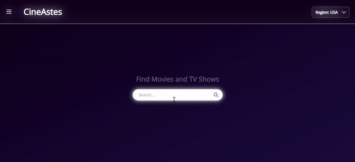

# CineAstes: A Movie Database Site with React

A movie database site built with React. Includes features like searching movies by titles, top and trending movies, and critic reviews.

## Features

- Built with React.
- Styled with Tailwind CSS.
- Search movies functionality provided by OMDb API (http://www.omdbapi.com/).
- Top and trending movies lists provided by TMDb (https://developers.themoviedb.org/3).
- Critic Reviews from NYT (https://developer.nytimes.com/) and The Guardian (https://open-platform.theguardian.com/).

## Demo

https://dericored.github.io/movie-db-site/
